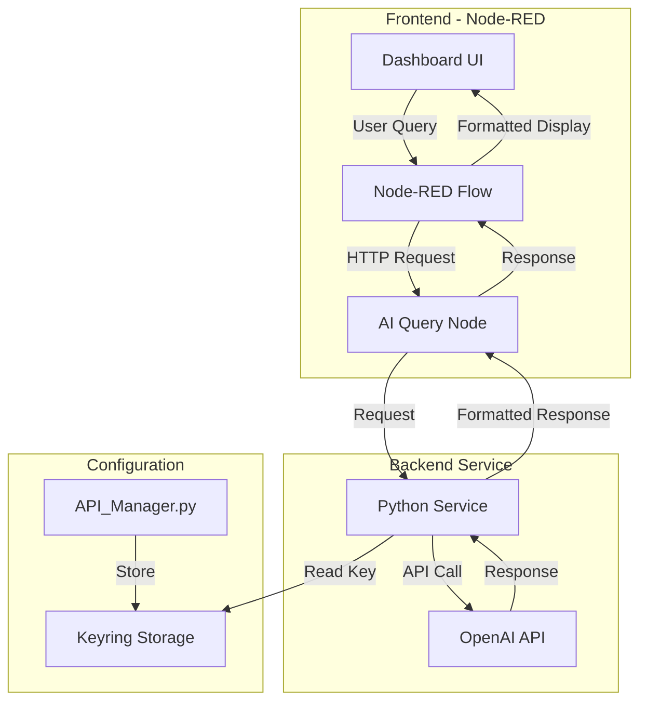

# AI Support Tool Setup Guide

This application extends an existing API Manager tool to provide AI-powered support via a Node-RED dashboard interface. It consists of a Python service that communicates with OpenAI's API and a Node-RED frontend for user interaction.

## Architecture


## Prerequisites
- Python 3.8+
- Node.js and npm
- OpenAI API key

## Installation Steps

1. **Install Dependencies**
```bash
# Install Python dependencies
pip install -r requirements.txt

# Install Node-RED globally if not installed
npm install -g node-red

# Install Node-RED dashboard
cd ~/.node-red  # or %USERPROFILE%\.node-red on Windows
npm install node-red-dashboard
```

2. **Configure OpenAI API Key**
- Run the original API Manager application:
```bash
python API_Manager.py
```
- Click "Configure API Keys"
- Enter your OpenAI API key
- Close the application

3. **Import Node-RED Dashboard**
- Start Node-RED:
```bash
node-red
```
- Open http://localhost:1880
- Click hamburger menu (≡)
- Select "Import"
- Import the provided `dashboard.json` template

## Starting the Application

1. **Start Python Service**
```bash
python api_manager_service.py
```

2. **Start Node-RED** (in a new terminal)
```bash
node-red
```

3. **Access the Dashboard**
- Open http://localhost:1880/ui
- Use the form to submit questions
- View AI responses in the formatted display

## Usage
1. Enter your question in the input form
2. Click "Ask AI"
3. View the formatted response
4. Debug output available in Node-RED debug panel

## Notes
- The Python service must be running for the AI functionality to work
- Ensure your OpenAI API key is configured before using the service
- The dashboard template includes pre-configured layouts and styling

## Troubleshooting
- If no response: Check Python service is running
- If API key error: Verify key in API_Manager.py
- If UI not loading: Check Node-RED dashboard installation

## Files
- `API_Manager.py`: Original application for key configuration
- `api_manager_service.py`: Python service for AI integration
- `requirements.txt`: Python dependencies
- `dashboard.json`: Node-RED dashboard template

---
*This tool extends the API Manager application to provide AI support services through a web interface.*
